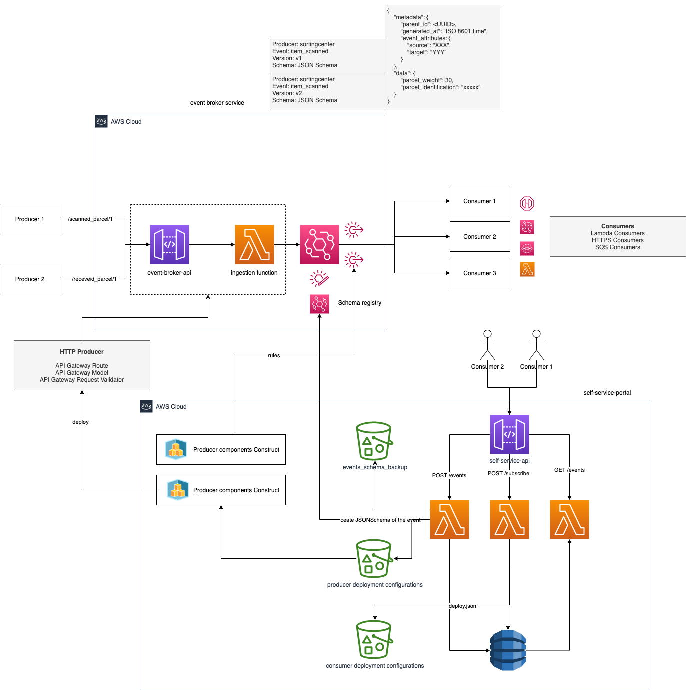

# Solution architecture for event broker system

The presented projects represents the solution architecture to create a self-servive event broker system
in AWS using event-driven approach with Amazon EventBridge.

Following you can see the diagram of the propose solution without including the list of the improvements that
can be applied to the architecture. You can read about the improvements not included on the solution design on the
"Solution architecture improvements" on the below section.

## Components

- **_Self-service portal_**: The back-end service that supports the possibility manage events (create, update, delete, subscribe, list). The
  managers of the events can be also consumers of that events. This back-end is built using [AWS SAM](https://docs.aws.amazon.com/serverless-application-model/latest/developerguide/what-is-sam.html) and uses the services: AWS APIGateway, AWS Lambda and AWS DynamoDB.

- **_Event Broker infrastructure_**: Infrastructure project which create a stack where includes a AWS APIGateway for producers and a custom event bus on EventBridge. The AWS APIGateway does not include any endpoint becauser all the endpoints will be deployed independently based on producer demand when an even is created (see more details on Producer components generator section)

- **_Event schema backup_**: All the events will be send to EventBridge registery so can be discover by consumers, but they also are saved as json format on a Amazon S3 backup, so we avoid that EventBridge registry is the single point of faiure and we can recreate the registry if it's required.

- **_Componets configuration storage service_**: When a event is created or some consumer subscribe to even through the self service portal, it will generate a deployment file with all the information required to build the components required by producers and consumers. Each of producers and consumers will have specific bucket. All the deployment json files will be use to trigger a new deployment of components. Bellow is detail which compoments are created based on deployment.

- **_Producer components generator_**: [AWS CDK](https://docs.aws.amazon.com/cdk/v2/guide/home.html) app which creates a stack of constructs with the main components for producers. There are two main types of producers: HTTPProducer and SQSProducer.

- **_Consumer components generator_**: [AWS CDK](https://docs.aws.amazon.com/cdk/v2/guide/home.html) app which creates a stack of cosntructs with the main components for consumers. Possible Consumers are: LambdaConsumer, SQSConsumer, HTTPConsumer.
