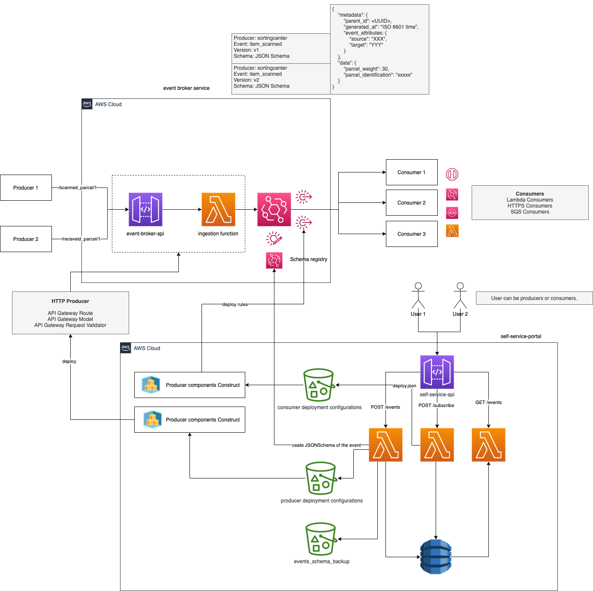

# Solution architecture for event broker system

The presented projects represents the solution architecture to create a self-servive event broker system
in AWS using event-driven approach with Amazon EventBridge.

Following you can see the diagram of the propose solution without including the list of the improvements that
can be applied to the architecture. You can read about the improvements not included on the solution design on the
"Solution architecture improvements" on the below section.

## Architectural components

- **_Self-service portal_**: The back-end service that supports the possibility manage events (create, update, delete, subscribe, list). The
  managers of the events can be also consumers of that events. This back-end is built using [AWS SAM](https://docs.aws.amazon.com/serverless-application-model/latest/developerguide/what-is-sam.html) and uses the services: AWS APIGateway, AWS Lambda and AWS DynamoDB.

- **_Event Broker infrastructure_**: Infrastructure project which create a stack where includes a AWS APIGateway for producers and a custom event bus on EventBridge. The AWS APIGateway does not include any endpoint becauser all the endpoints will be deployed independently based on producer demand when an even is created (see more details on Producer components generator section)

- **_Event schema backup_**: All the events will be send to EventBridge registery so can be discover by consumers, but they also are saved as json format on a Amazon S3 backup, so we avoid that EventBridge registry is the single point of faiure and we can recreate the registry if it's required.

- **_Componets configuration storage service_**: When a event is created or some consumer subscribe to even through the self service portal, it will generate a deployment file with all the information required to build the components required by producers and consumers. Each of producers and consumers will have specific bucket. All the deployment json files will be use to trigger a new deployment of components. Bellow is detail which compoments are created based on deployment.

- **_Producer components generator_**: [AWS CDK](https://docs.aws.amazon.com/cdk/v2/guide/home.html) app which creates a stack of constructs with the main components for producers. There are two main types of producers: HTTPProducer and SQSProducer.

- **_Consumer components generator_**: [AWS CDK](https://docs.aws.amazon.com/cdk/v2/guide/home.html) app which creates a stack of cosntructs with the main components for consumers. Possible Consumers are: LambdaConsumer, SQSConsumer, HTTPConsumer.

# How to install

In the main path of the projects you can find a script called `local_deploy.sh` that will help you to make the local deployment
of all the components in your own AWS Account:

- Initial requirements:
  - Make sure you have an AWS Account create
  - Make sure that you have a IAM profile setup in your local machine
  - Run `chmod +x local_eploy.sh` to make the file executabler
  - Make sure that you have install in you local machine SAM CLI and CDK CLI.

## Deployment script steps

General notes:

- All the stacks and services follow the same naming convention. On company environment the name can be more fine grane created
  adding the system, subsystem and team owner of the service. In this case for simplicity, the environment and dash for each component
  the name.

### Step 1: Creating schema backup bucket

The first step of the script is created an auxiliary bucket to store the events created on the service portal. Thisis created
just as support mechanism in case on disaster, so the registry is deleted and needs to be recreated with all the events.

Artifacts created:

Stack name: `{enviroment}-event-schemas-backup-service`
Bucket name: `{enviroment}-event-schemas-backup-bucket`

Notes:

- Name of those buckets are not dynamic except of the environment, so can be use the same name for other services.
- After using the self-service portal if you want to restart the infrastructure from scratch you will need to
  to delete first all its content

### Step 2: Creating configuration storage buckets

In the second step of the script is created a stack that contains two buckets which will contain the deployment configuration for the
components the architecture will create automatically for consumers and producers after a producer creates an event or a consumer
subscribe to an event through the service portal

Artifacts created:

Stack name: `{enviroment}-components-configuration-storage-service`
Bucket name for procuders: `{enviroment}-publisher-components-bucket`
Bucket name for consumers: `{enviroment}-subscriber-components-bucket`

Notes:

- Name of those buckets are not dynamic except of the environment, so can be use the same name for other services.
- After using the self-service portal if you want to restart the infrastructure from scratch you will need to
  to delete first all its content

### Step 3: Event broker insfrastructure

In the third step we are going to create the infrastructure to insject events via API Gateway and one
custom event bus to inject all our events. The current implementation supports HTTP producers. One of the
improvements to be done is to add another type of producers

Artifacts created:

Stack name for the API Gateway: `{enviroment}-event-broker-api-service`
Stack name for event bus: `{environment}-event-broker-bus`
Broker bus: `{environment}.custom.events.bus`
API Gateway + Lamda injector: `{environment}-event-broker-api`

Notes:

- API Gateway does not have any resource associated because all the producers will create their own
  set of components base on the creation of the events on the self sevice portal.

### Step 4: Deploy the Self service portal

In the fourth step we need to depoy the service that interacts with the users to manage their events.
This application used AWS SAM and uses the buckets and objects that we created on the previous steps

Artifact created:

Stack name: `{enviroment}-self-service-portal`
API Gateway: `{environment}-self-service-portal-api`
DynamoDBTable: `{environment}-self-service-events-table`
